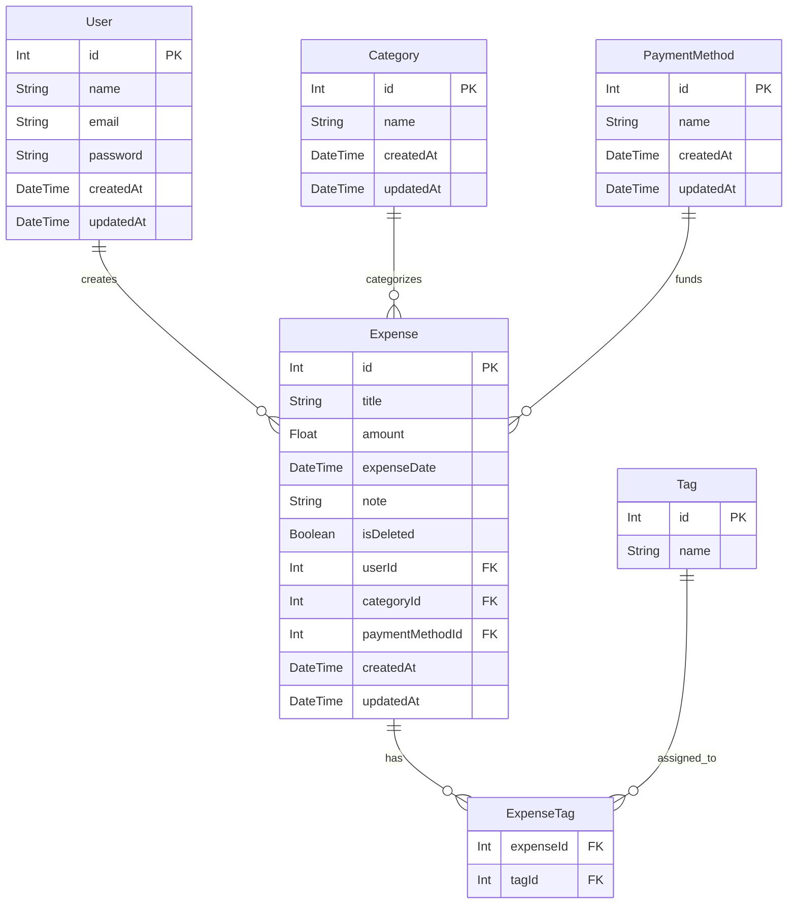

# ER Diagram

```mermaid
erDiagram
    User ||--o{ Expense : "creates"
    Category ||--o{ Expense : "categorizes"
    PaymentMethod ||--o{ Expense : "funds"
    Expense ||--o{ ExpenseTag : "has"
    Tag ||--o{ ExpenseTag : "assigned_to"

    User {
        Int id PK
        String name
        String email
        String password
        DateTime createdAt
        DateTime updatedAt
    }

    Category {
        Int id PK
        String name
        DateTime createdAt
        DateTime updatedAt
    }

    PaymentMethod {
        Int id PK
        String name
        DateTime createdAt
        DateTime updatedAt
    }

    Expense {
        Int id PK
        String title
        Float amount
        DateTime expenseDate
        String note
        Boolean isDeleted
        Int userId FK
        Int categoryId FK
        Int paymentMethodId FK
        DateTime createdAt
        DateTime updatedAt
    }

    Tag {
        Int id PK
        String name
    }

    ExpenseTag {
        Int expenseId FK
        Int tagId FK
    }
```
